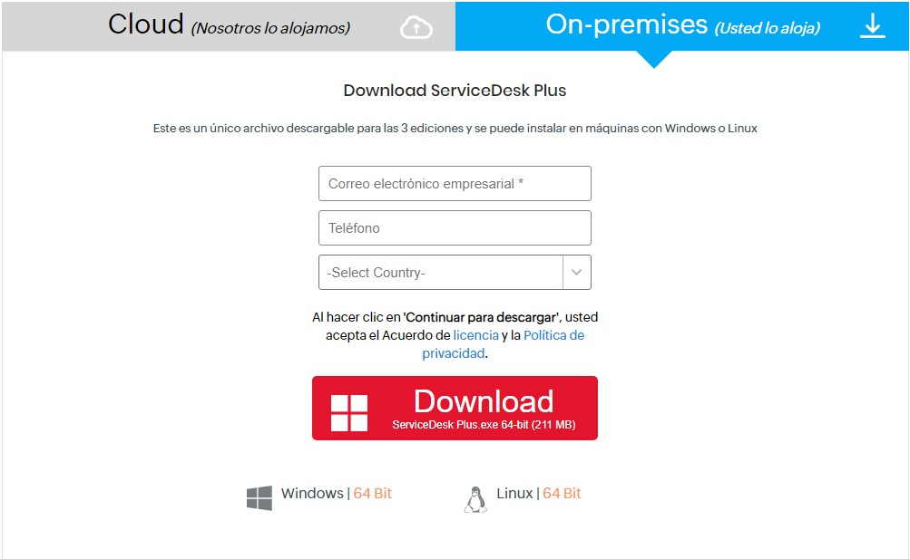

# Alojamiento Propio

Alojaremos nosotros mismos la web de servicio de tickets para ellos vamos al siguiente enlace

Enlace a [Descarga de ejecutable](https://www.manageengine.com/es/service-desk/descargas.html)

**Ejecutamos la aplicacion para completar la instalacion y seguimos los siguientes pasos**

## Al terminar nos redirige a la página web 

El usuario y contraseña por defecto es *administrator* en los dos campos

Y al entrar se nos ve algo así

A partir de aqui podemos programar diferentes acciones

Por ejemplo tenemos la posibilidad de agregar tareas 

Por ejemplo:

Agregar soluciones para los problemas resueltos 

Tendremos diferentes plantillas para realizar informes automaticamente

Aqui un ejemplo :

Tenemos tambien distintos foros donde la comunidad puede ayudar a resolver errores

Podemos crear roles para nuestros empleados y categorizarlos

Asi como crear usuarios en un ominio o importarlos desde active directory

También tenemos un apartado para crear solicitudes 

En la parte superior derecha encontramos tambien distintas acciones rápidas

Y acabamos visualizando el panel de control , donde ajustar los parametros para la realizacion de las anteriores tareas

### Si queremos conectarla auna base de datos

**Tendremos que disponer de un servidor sql**

En mi caso el Management Studio en el cual creamos un usuario y contraseña

En el Service Desk vamos al lugar de instalacion y entramos en la carpeta *bin* y abrimos este archivo :

**Y asi la tendremos conectada para guardar nuestros datos , nos creara una base de datos llamada Service Desk**

