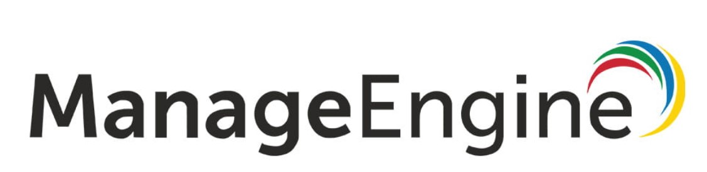

# Guia Manage engine - Service Desk
 
 
 
 
 **Uso de un software de organizacion**

Permite la gestión de incidencias, problemas, cambios y proyectos, gestión del inventario, seguimiento de pedidos de compra y
contratos de mantenimiento, SLAs, gestión de conocimientos, encuestas de satisfacción y mucho más. Se destaca el módulo de
inventario automático, que permite recopilar automáticamente información sobre el HW y SW de todos los PCs y servidores, así
como la electrónica de red, sin necesidad de instalar ningún agente en las máquinas remotas. Por su parte, el módulo de
CMDB, permitirá establecer relaciones entre los elementos de configuración para identificar rápidamente el impacto de
cualquier problema en la infraestructura

- Interfaz gestión web sencilla e intuitiva.
- Interfaz habilitada para Smartphone (iOS y Android).
- Instalación en minutos.
- Excelente relación funcionalidad/precio.
- Disponible en Español

#### Existen dos modos de usar el servicio ####

**[- Mediante Clouding](clouding.md)**

**[- Alojamiento propio](/Alojamiento.md)**