# Alojamiento mediante Clouding

#### Creación de una cuenta

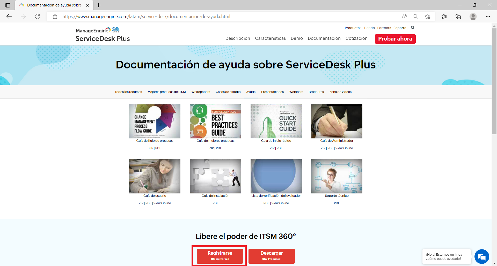

Como señala la imagen anterior, lo primero para el hosting de Manage-Engine será registrarse.

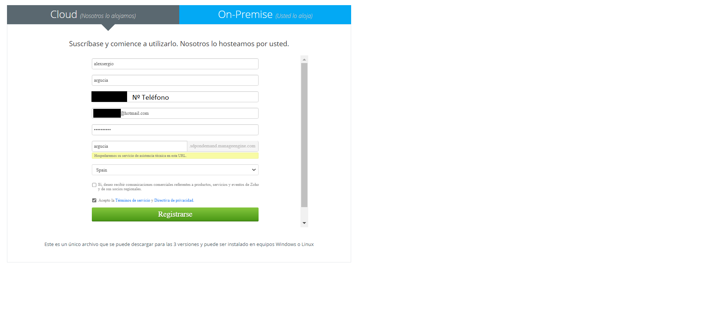

Pondremos nuestros datos o los de nuestra empresa como tal.

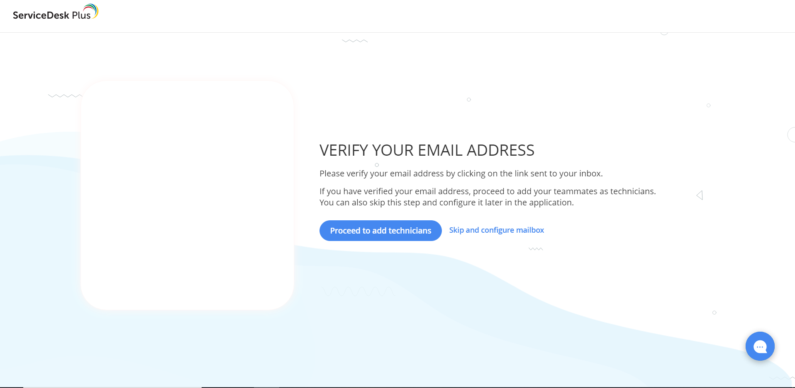

Luego de esto, nos pedirá la verificación del correo electrónico.

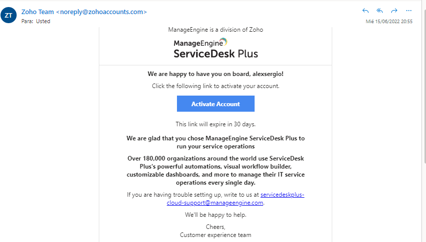

Hecho esto, ya estaríamos dentro de la aplicación.

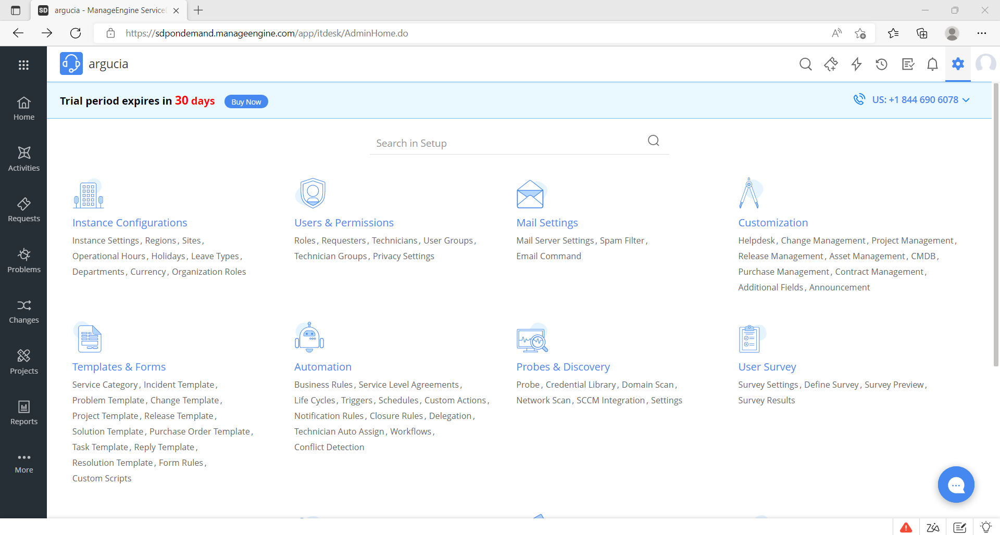

#### Configuración  en la nube

La principal pestaña que nos interesa es la llamada "Instance Configurations"
En esta, configuraremos todo lo relacionado con como se ve nuestra empresa y como se conoce a la misma.

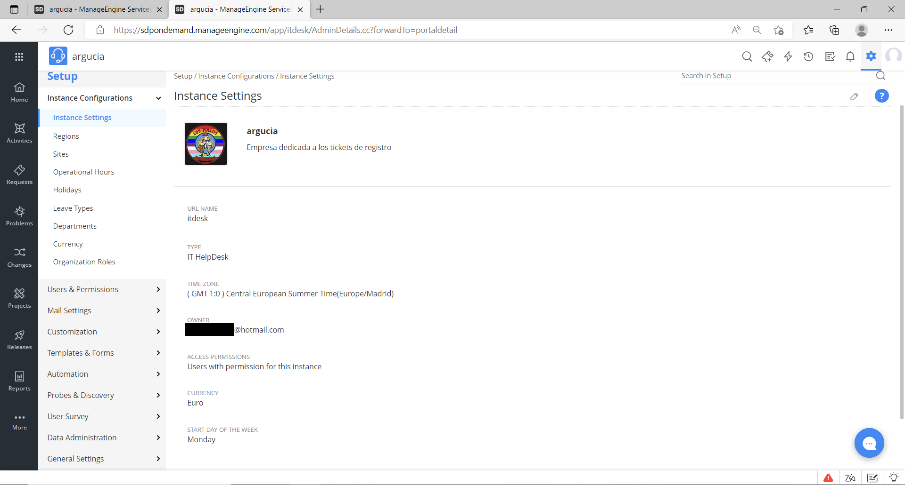

##### Actividades

Esta pestaña la usaremos para apuntar las actividades que se están llevando a cabo en la empresa.

**Nota** 
En la parte de la izquierda se puede ver alguna posible solución al fallo.

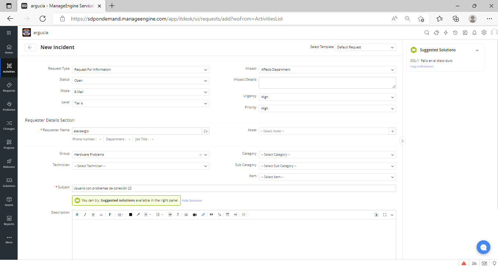

##### Peticiones

Esta pestaña la usaremos para crear una petición al servidor, asi como para notificar fallos a los técnicos de la empresa.

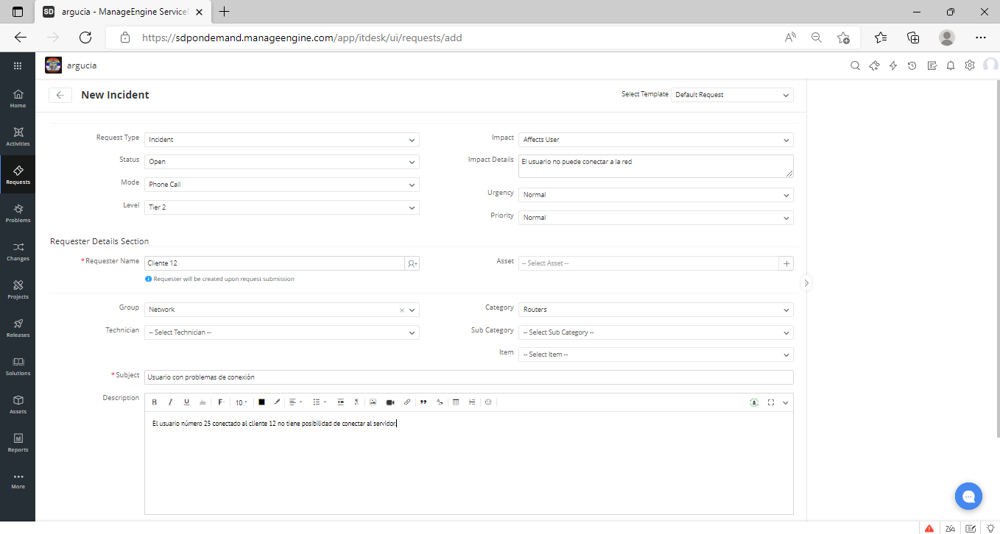

##### Problemas

Esta pestaña la usaremos para informar de los problemas tanto de los usuarios como de los equipos de la empresa.

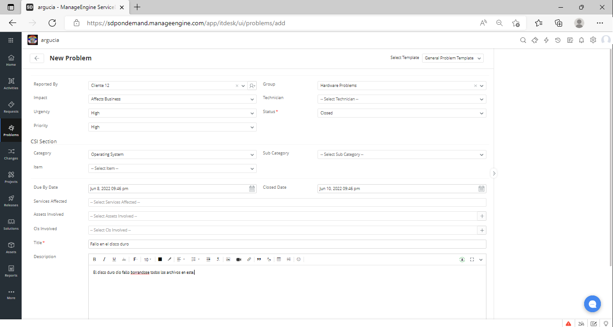

##### Cambios

Esta pestaña la usaremos para informar de los cambios hechos dentro de la empresa.

##### Proyectos

Esta pestaña la usaremos para ir teniendo un seguimiento de los proyectos que la empresa está llevando a cabo.

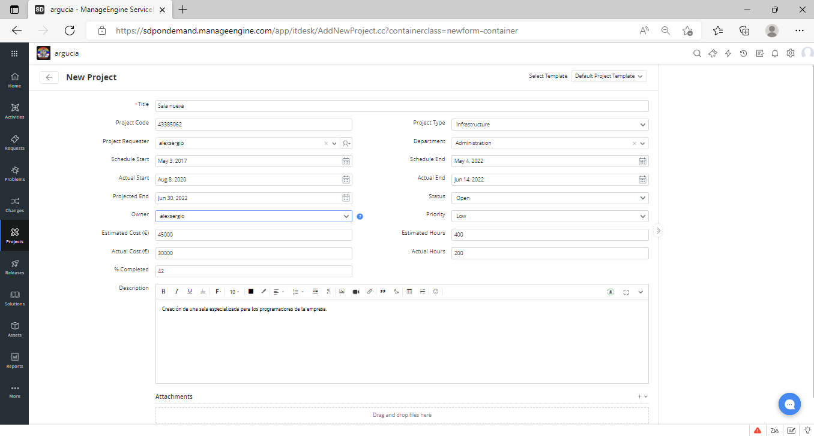

##### Soluciones

Esta pestaña la usaremos para anotar todos los fallos que han sido resueltos dentro de nuestra empresa.

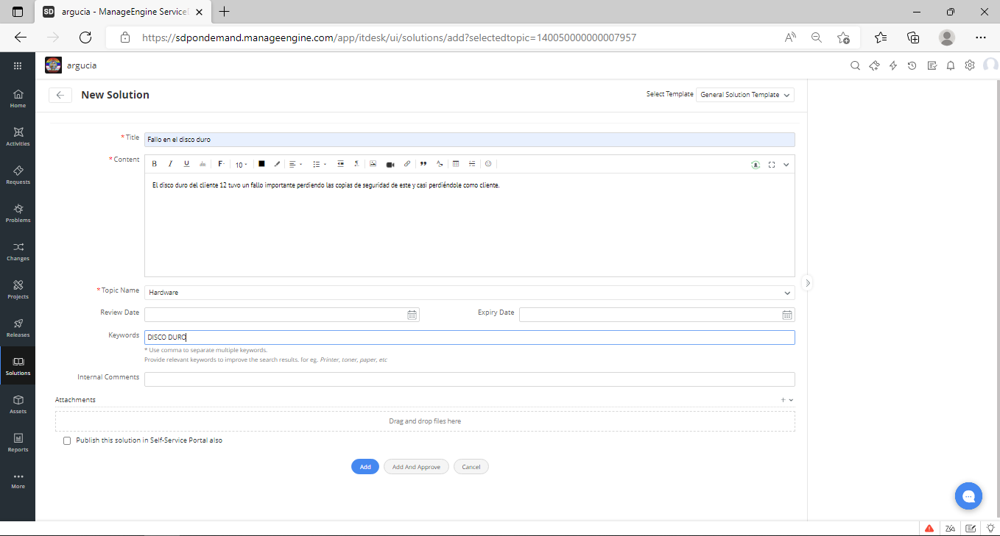

##### Activos

Esta pestaña sirve para anotar para todos los equipos que estan en la empresa.

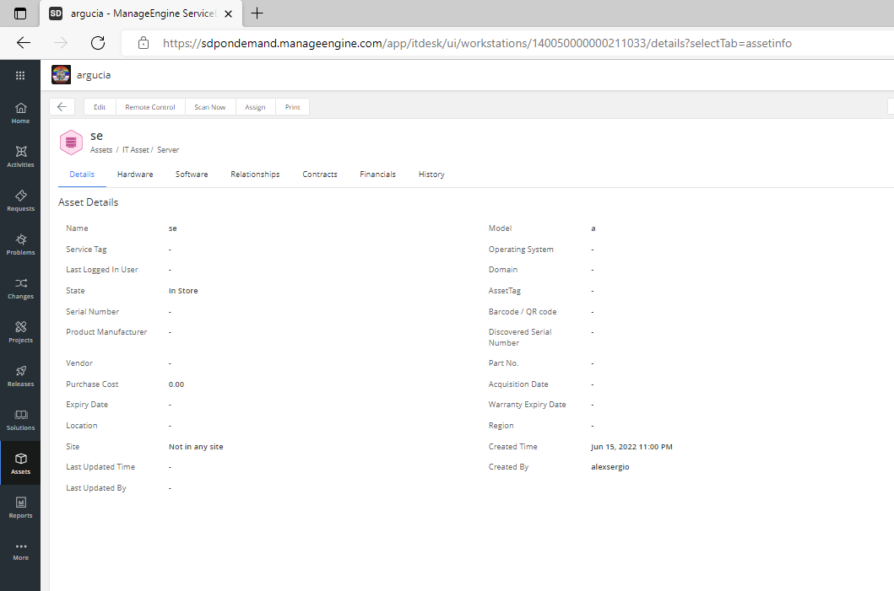

##### Reportes

Esta pestaña sirve para guardar todos los incidentes sucedidos en la empresa.

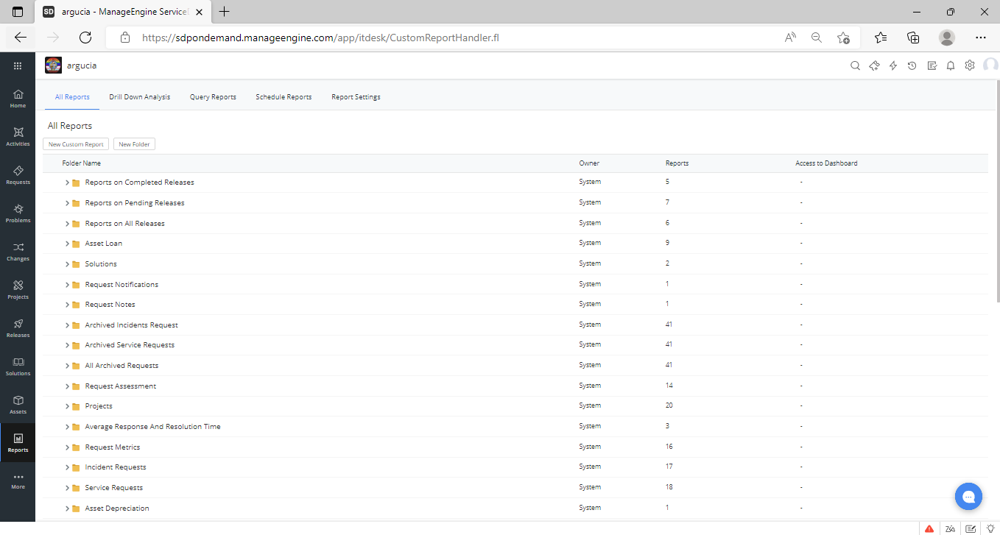

##### Mantenimiento

Esta pestaña sirve para anotar todas las peticiones para mantenimiento.

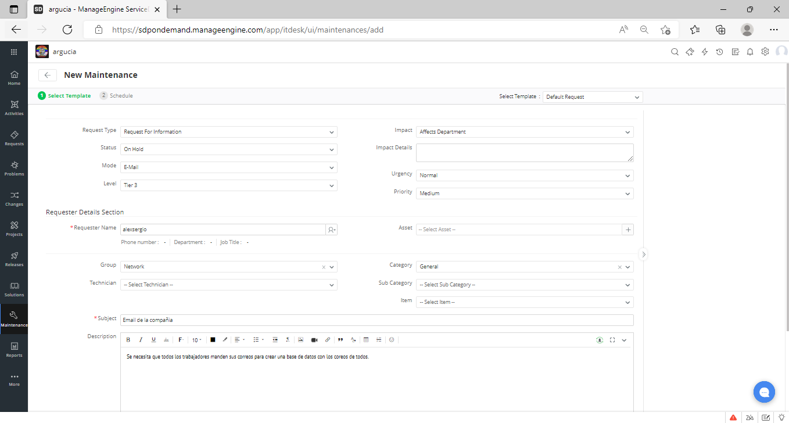

##### Contratos

Esta pestaña sirve para anotar los contratos que realicen para la empresa.

