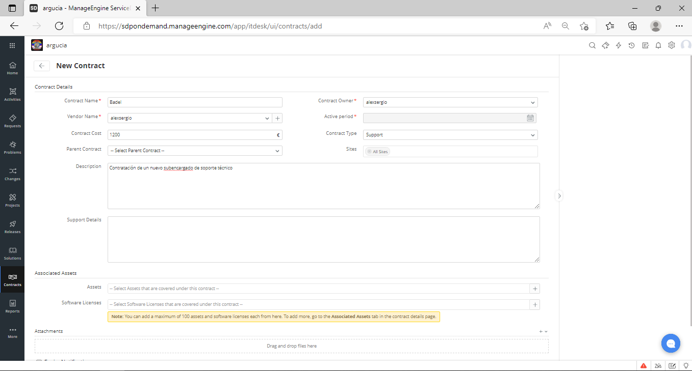

# Alojamiento mediante Clouding

#### Creación de una cuenta

Como señala la imagen anterior, lo primero para el hosting de Manage-Engine será registrarse.

Pondremos nuestros datos o los de nuestra empresa como tal.

Luego de esto, nos pedirá la verificación del correo electrónico.

Hecho esto, ya estaríamos dentro de la aplicación.

### Opciones para el administrador

##### Actividades

Esta pestaña la usaremos para apuntar las actividades que se están llevando a cabo en la empresa.

**Nota** 
En la parte de la izquierda se puede ver alguna posible solución al fallo.

##### Peticiones

Esta pestaña la usaremos para crear una petición al servidor, asi como para notificar fallos a los técnicos de la empresa.

##### Problemas

Esta pestaña la usaremos para informar de los problemas tanto de los usuarios como de los equipos de la empresa.

##### Cambios

Esta pestaña la usaremos para informar de los cambios hechos dentro de la empresa.

##### Proyectos

Esta pestaña la usaremos para ir teniendo un seguimiento de los proyectos que la empresa está llevando a cabo.

##### Soluciones

Esta pestaña la usaremos para anotar todos los fallos que han sido resueltos dentro de nuestra empresa.

##### Activos

Esta pestaña sirve para anotar para todos los equipos que estan en la empresa.

##### Reportes

Esta pestaña sirve para guardar todos los incidentes sucedidos en la empresa.

##### Mantenimiento

Esta pestaña sirve para anotar todas las peticiones para mantenimiento.

##### Contratos

Esta pestaña sirve para anotar los contratos que realicen para la empresa.

### Ajustes

#### Configuración de las instancias

En esta, configuraremos todo lo relacionado con como se ve nuestra empresa y como se conoce a la misma.

#### Usuarios y permisos

En esta pantalla podremos configurar que usuarios va a tener nuestra empresa y los permisos para estos.

#### Ajustes de correo

En esta pantalla podremos configurar el mail de nuestra empresa, así como por donde salen, cuales considerar spam y otras funciones.

#### Customización

En esta pantalla podremos personalizar como veremos todas las pestañas de la izquierda, así como que saldrá para cada problema.

#### Plantillas y fomularios

En esta pantalla podremos usar plantillas y formularios para como se verán en cuanto el técnico entre a la aplicación online.

#### Automatización

En esta pantalla se utilizará para programar que el sistema automáticamente te de soluciones para problemas que ya hayan sucedido anteriormente.

#### Pruebas y descubrimientos

En esta pantalla la utilizaremos para apuntar todas las pruebas y descubrimiento que realize la empresa.

#### Encuestas

En esta pantalla podremos crear encuestas para los clientes, usuarios o administradores de la empresa.

#### Administración de datos

En esta pantalla podremos administrar los datos que llegan a nuestro servidor dentro de la empresa.

#### Ajustes generales

En esta pantalla podremos configurar los ajustes generales de la aplicación.

#### Aplicaciones y add-ons

En esta pantalla podremos configurar diversas aplicaciones tales como un chat, que los usuarios puedan ver proyectos, etc...

#### Espacio para los desarrolladores

En esta pantalla los desarrolladores podrán subir código o cambiar el mismo dentro de la aplicación online.

#### Zia(inteligencia artifical)

En esta pantalla podremos dar permisos a Zia, una IA que nos permite facilitar el uso de la aplicación además de resolver a los usuarios problemas que esta como tal aprende de la aplicación.

